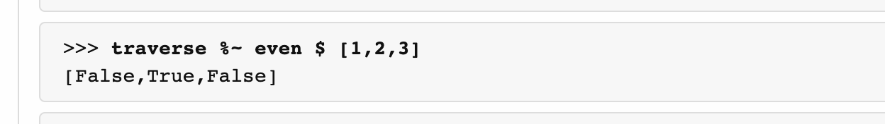
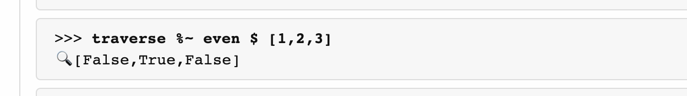
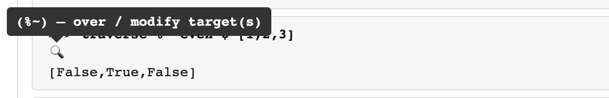
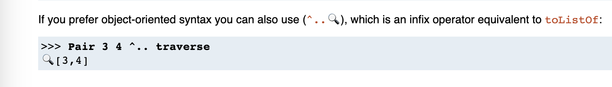
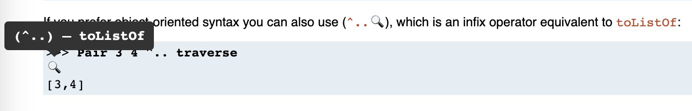

# Chrome Annotation Extension Template

A [chrome extension](https://developer.chrome.com/docs/extensions/) to annotate optic operators with their names.

Decrypt any optic example, code, or tutorial. Works with more-or-less any website (e.g., GitHub, hackage)

Built using [chrome-annotation-extension-template](https://github.com/fghibellini/chrome-annotation-extension-template).

## In action

### Annotated hackage docs

With extension disabled:

With extension enabled:

On hover: 

### Annotated tutorial

With extension enabled:

On hover: 

