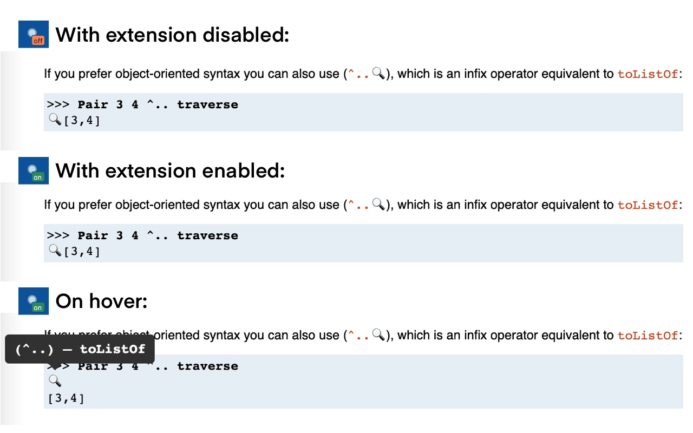
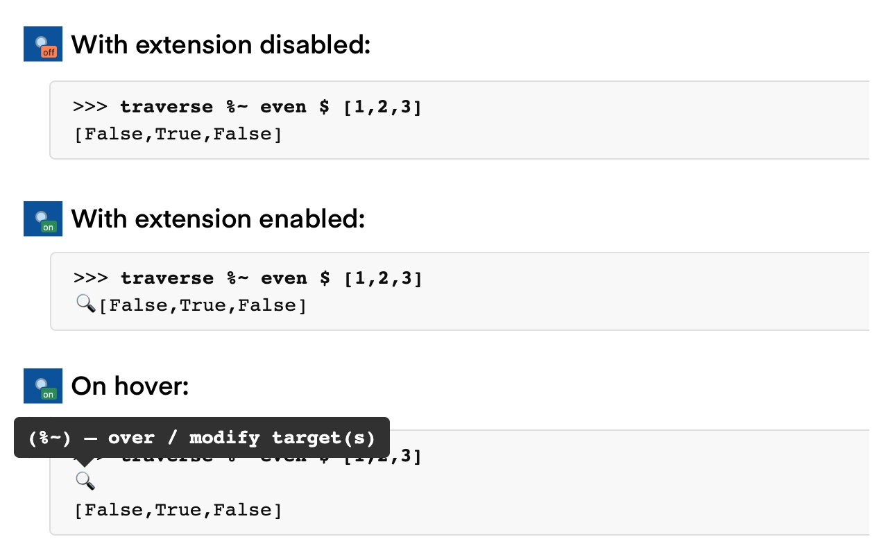

# Named Optic Operators

A chrome extension to annotate optic operators with their names. You can find it in your local [web store](https://chrome.google.com/webstore/detail/named-optic-operators/cbbihjchidehcbnkghkfedfknieknibf).

It can decrypt any optic example, code, or tutorial. Works with more-or-less any website (e.g., GitHub, hackage)

Built using [chrome-annotation-extension-template](https://github.com/fghibellini/chrome-annotation-extension-template).

## In action

### Annotated hackage docs

### Annotated tutorial

